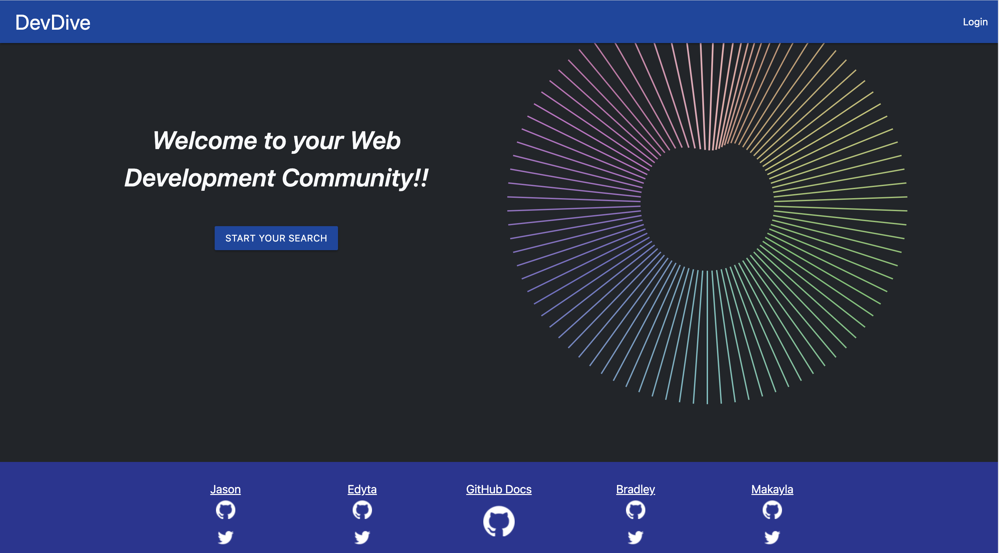
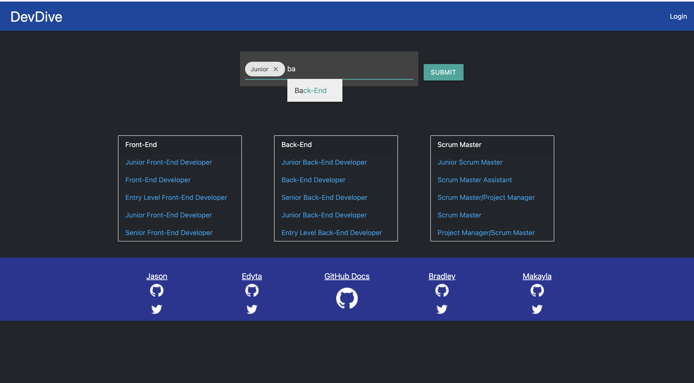
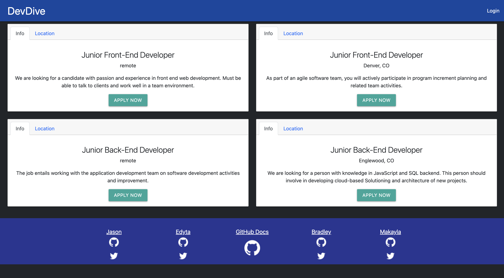
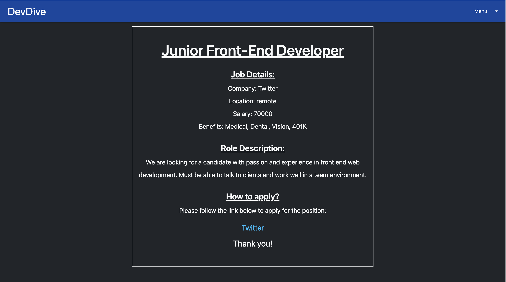
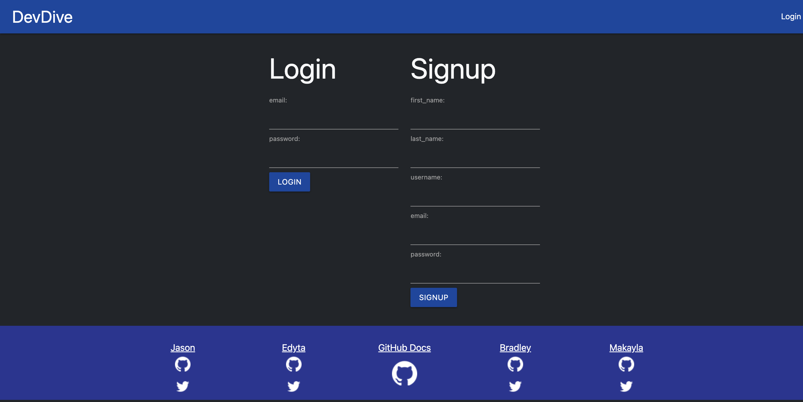
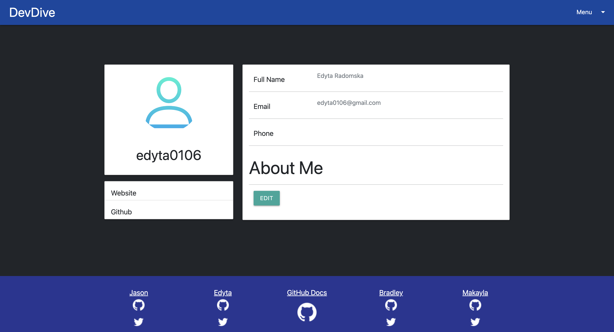

# Project 2


## Table of Contents

[Description](#description)

[Install](#install)

[Usage](#usage)

[Credits](#credits)

[License](#license)

[Mock-Up](#mock-up)

## Description

The DevDive app allows people with a love for tech to connect from anywhere in an environment that breeds creativity.

The app allows users to easily search for jobs within the tech industry through specifics like Front-End, Back-End, Scrum Master, Senior, Junior and more. Create an account and apply for jobs based on preferences and experience.

## User Story

```
AS A - Web Developer interested in tech jobs
I WANT - an app that makes it easy to search for career opportunities
SO THAT - I can seek out jobs in the tech industry based on experience and preferences
```

## Install

npm i, npm run seed, express, express-handlebars, express-session, sequelize, anime.js

## Usage

Easily search for jobs in the tech industry based on experience and preferences. Create an account. Apply for jobs by following the provided company link in job description.

## Credits

- Bradley Rodriguez
- Edyta Radomska
- Jason Duran
- Makayla Cordova

## License

[MIT License](https://opensource.org/licenses/MIT)

## Mock-Up

The following link takes you to the deployed application:

[DevDive](https://dev-dive.herokuapp.com/)

Homepage:



Search Page:



Results Page:



Job Description Page:



Login Page:



Profile Page:


